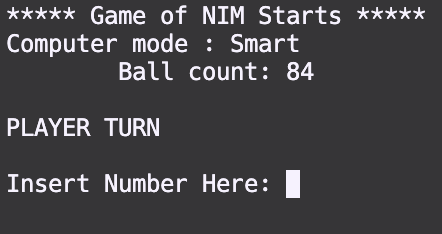
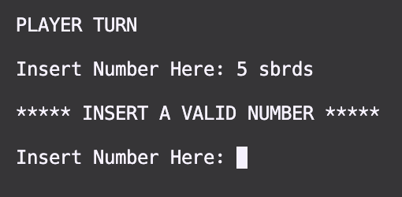

# NimGame
By: Andrew Bernklau, Charlie Fink, Victor Flores-Benito, Maia Taylor

## Overview
This is a program developed in C++ to test what we as a team have learned over the spring semester of 2023 at RRCC in Computer Science I. The NimGame is a marble game played by a user and the computer. A pile of marbles is randomly generated between 10 and 100. Each player takes turns pulling marbles from the pile and the one who pulls the final marble loses. The program randomly determines who goes first, the user or the computer. After, the program then chooses randomly whether the computer is smart or dumb. The difference between the intellectual levels of the computer determines whether the computer will pull a random amount between 1 and half the pile size or enough to return a pile size equal to $2^n - 1$.



## Features
The main features included within this program to support our understanding of C++ as students comprise of user input validation, function prototyping and defining, and the use of the stdlib within C++. These features combine to make a robust, efficient, and readable program for others to easily enjoy. Our user input validation requires the user to input a valid integer; zero spaces and alphabetical or special characters are valid nor is an integer larger than half the pile size. To handle these cases we have deployed the use of functions. We have incorporated our own isAllDigits boolean function to handle the input of spaces and other non-integer characters. This functions is coupled with a second boolean function called isInRange to check the integer size. With these the overall gameplay function have also been created. A function has been created for each computer intelligence system. These functions provide the functionality of the computer's intelligence. The function for computerStupid uses the rand function to determine the amount of marbles the computer will take from the pile. While the computerSmart function uses a for loop that iterates over a predefined list of $2^n-1$ values to find the correct pile size it for which it should reduce.



## Known Bugs
As of now there are zero known bugs. Originally we had found that the pile would change to a unreasonably massive number when playing against computerSmart and the pile size was 2. This was easily fixed by adding a check for when the pile size became this small the computer would make sure to pick only 1 marble from the pile.

## Repository Structure
```
├── readme_images
│   ├── game_board.png
│   └── input_validation_1.png
├── .gitignore
├── NimGame.cpp
└── README.md
```